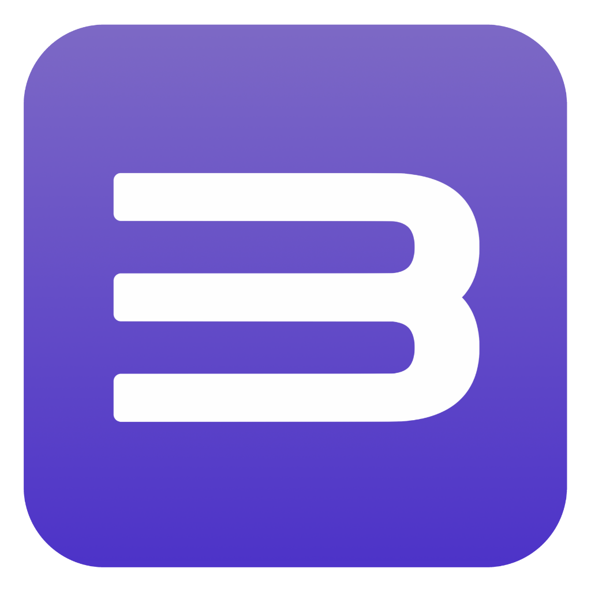

# RPCS3 Android

Fork of the official RPCS3 Android port. Right now the project is in a very early stage. At this moment I just wanna see if it works. Any PRs are welcome.

> [!NOTE]
> I plan to develop a fully featured fork of RPCS3 as soon as the official Android version is released and I gain enough experience with Kotlin and C++.

# License

This project is licensed under the same terms as the official RPCS3. See [LICENSE](LICENSE) for details.

> [!NOTE]
> I'm not affiliated with the official RPCS3 team. The base of the port is also not my work.
