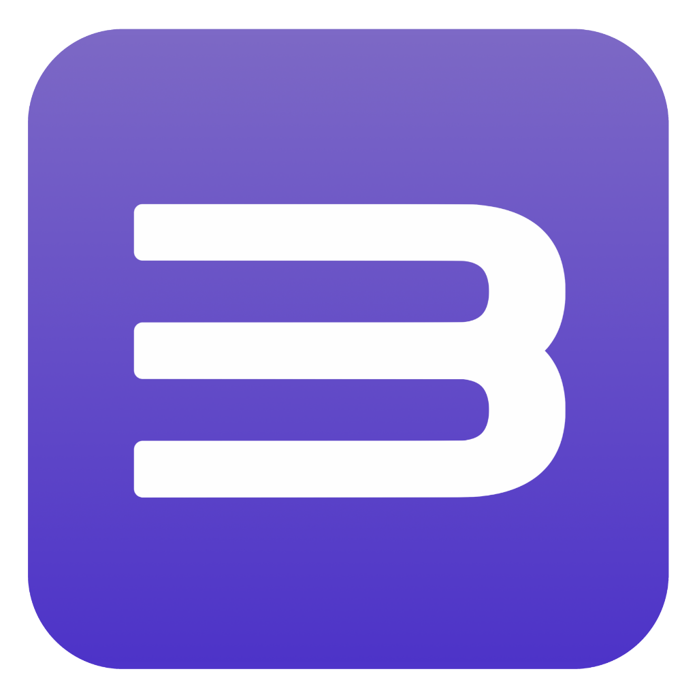

# RPCS3 Android

Fork of the official RPCS3 Android port. Right now the project is in a very early stage. At this moment I just wanna see if it works. Any PRs are welcome.

> [!WARNING]
> Most of the code that I (Alexoqool) add was written in the 2024 Q3/Q4, so it might be unclear or messy and most likely will be rewritten in future.

# TODO

- [ ] Fix crash on startup (native-lib.cpp)
- [ ] Implement and test OpenGL

# License

This project is licensed under the same terms as the official RPCS3. See [LICENSE](LICENSE) for details.

> [!NOTE]
> I'm not affiliated with the official RPCS3 team. The base of the port is also not my work.